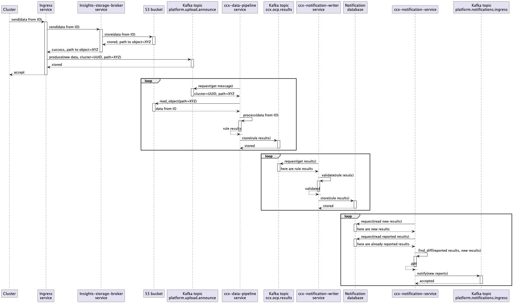
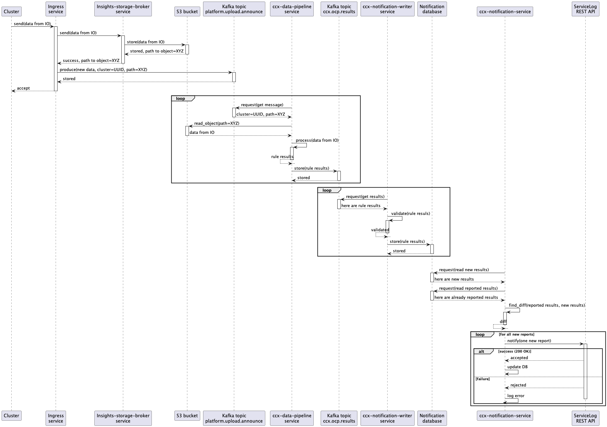
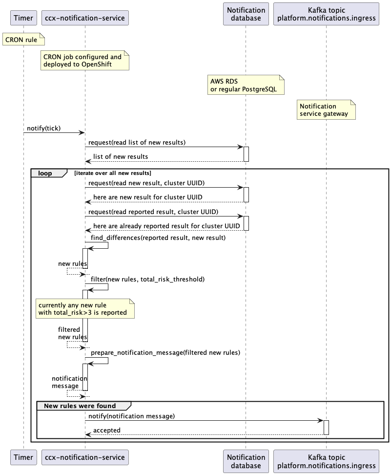

# Data flow

The "end-to-end" data flow is described there (including Notification Writer service part):

1. A customer cluster with *Insights Operator* installed sends new data containing info about the cluster into *Ingress service*
1. The *Ingress service* consumes the data, writes them into an S3 Bucket, and produces a new message into a Kafka topic named `platform.upload.announce`.
1. The *CCX Data pipeline* service consumes the message from the `platform.upload.announce` Kafka topic.
1. That message represents an event that contains (among other things) an URL to S3 Bucket.
1. Insights operator data is read from S3 Bucket and *insights rules* are applied to that data in `ccx-data-pipeline` service.
1. Results (basically `organization ID` + `cluster name` + `insights results JSON`) are stored back into Kafka, but into different topic named `ccx.ocp.results`.
1. That results are consumed by `ccx-notification-writer` service.
1. `ccx-notification-writer` service stores insights results into AWS RDS database into `new_reports` table.
1. Content of that table is consumed by `ccx-notification-service` periodically.
1. Newest results from `new_reports` table is compared with results stored in `reported` table. The records used for the comparison depend on the configured cool down time.
1. If changes (new issues) has been found, notification message is sent into Kafka topic named `platform.notifications.ingress`. The expected format of the message can be found [here](https://core-platform-apps.pages.redhat.com/notifications-docs/dev/user-guide/send-notification.html#_kafka).
1. New issues are also sent to Service Log via REST API. Because Service Log accepts description and content to be represented in Markdown, issues are "rendered" first by [Insights Content Template Renderer](https://github.com/RedHatInsights/insights-content-template-renderer). To use the Service Log API, the `ccx-notification-service` uses the credentials stored in [vault](https://vault.devshift.net/ui/vault/secrets/insights/show/secrets/insights-prod/ccx-data-pipeline-prod/ccx-notification-service-auth).
1. The newest result is stored into `reported` table to be used in the next `ccx-notification-service` iteration.

### Remarks

1. Steps 1 to  5 are shared with the CCX Data pipeline
1. Steps 7 and 8 are performed by `ccx-notification-writer` service.
1. Steps 9 to 13 are performed by `ccx-notification-service` service with the help of Insights Content Service and Insights Content Template Renderer.

## Cool down mechanism

The cool down mechanism is used to filter the previously reported issues so
that they are not continuously sent to the customers. It works by defining a
minimum amount of time that must elapse between two notifications. That cool
down time is applied to all the issues processed during an iteration.

The value expected in the configuration is a string that respects the format of PostgreSQL's [interval type](https://www.postgresql.org/docs/current/datatype-datetime.html#DATATYPE-INTERVAL-INPUT).

### Data flow of the notification service without cool down

See steps 9 to 12 of the [data flow section](#data-flow)

### Data flow of the notification service with cool down

1. The latest entry for each distinct cluster in the `new_reports` table is consumed by the `ccx-notification-service`.
1. Results stored in `reported` table within the cool down time are retrieved. Therefore all the reported issues that are not older than the configured cool down are cached in a `previouslyReported` map by the service in each iteration.
1. When checking for new issues in the report, the `ccx-notification-service` looks up each issue in the `previouslyReported` map, and if found, that issue is considered to still be in cool down and is not processed further. If not found, the processing of the issue continues.
1. If changes (new issues) has been found between the previous report and the new one, a notification message is sent into Kafka topic named `platform.notifications.ingress`. The expected format of the message can be found [here](https://core-platform-apps.pages.redhat.com/notifications-docs/dev/user-guide/send-notification.html#_kafka).
1. New issues is also sent to Service Log via REST API. To use the Service Log API, the `ccx-notification-service` uses the credentials stored in [vault](https://vault.devshift.net/ui/vault/secrets/insights/show/secrets/insights-prod/ccx-data-pipeline-prod/ccx-notification-service-auth).
1. The newest result is stored into `reported` table to be used in the next `ccx-notification-service` iteration.

### Configuring the cool down mechanism

The cooldown mechanism can be configured by specifying the `cooldown` field under the `notifications` configuration in the [config.toml](../config.toml) file or by setting the `CCX_NOTIFICATION_SERVICE__NOTIFICATIONS__COOLDOWN` environment variable.

The value set is used directly within an SQL query, so the expected format is an integer followed by a valid SQL epoch time units (year[s] month[s] day[s] hour[s] minute[s] second[s])

## Sequence diagram

[Sequence diagram, full scale](images/sequence_diagram.png)

## Sequence diagram for the whole pipeline - Service Log integration

[Sequence diagram, full scale](images/sequence_diagram._service_logpng)

## Sequence diagram for instant reports

[Full scale](images/instant_reports.png)

## Sequence diagram for weekly reports

[Full scale](images/weekly_reports.png)

## Sequence diagram for CCX Notification Writer service

[Sequence diagram for CCX Notification Writer service](images/sequence_diagram_notification_writer.png)
