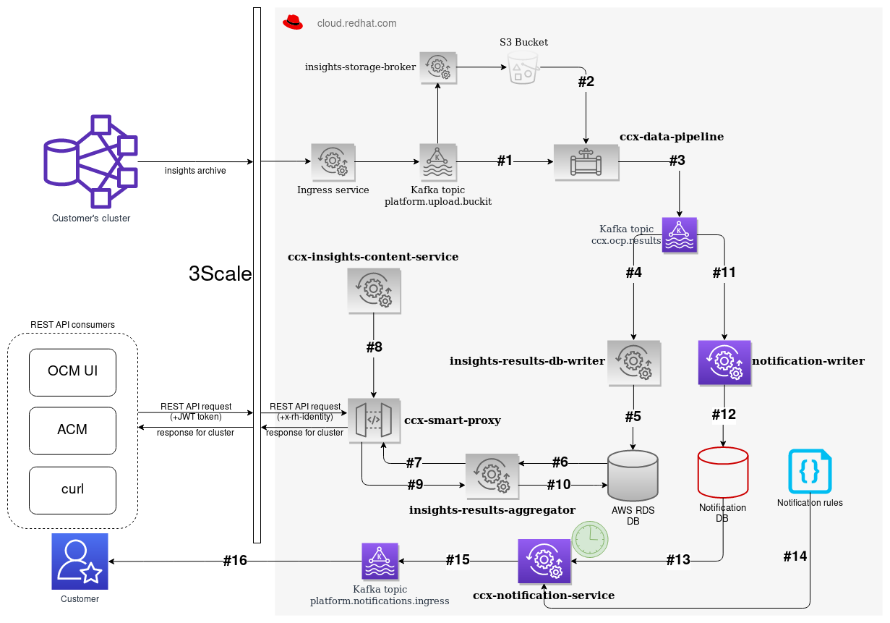
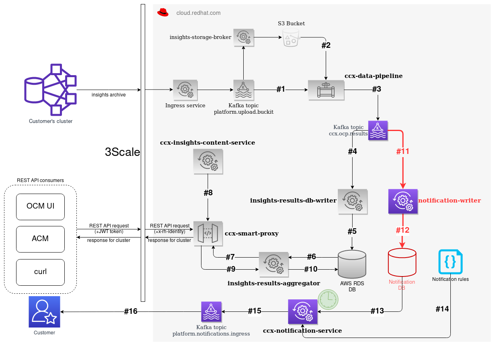
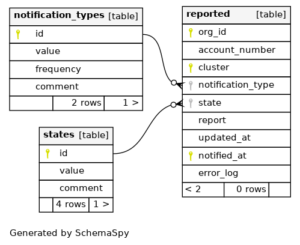

# Usage of DB indexes to optimize data throughput in CCX Notification Service

* Notification service is going to be part of the CCX External data pipeline
* With the same input stream
* But with separated database

## Database requirements

### Original CCX External data pipeline


* Scales linearly with number of clusters (`cluster_uuid` is primary key)
* 3633 events per hour
* 250 kB per event
* 768 MB per hour
* 6.4 TB per year
* 10 minimal required scale factor
* 64 TB per year

* Read operations are (hopefully) spread over time

### Notification service



* Need to store historical data as well
* Scales with number of clusters **and** the duration for the older reports
* Still ~768 MB of new data each hour, but w/o overwrite of old data
* For 1 week duration it is approximately 12x7 times more than in the original pipeline
* **And** database queries differs as well
    - a lot of `ORDER BY` clauses for example

### Write operations are continuous



Write (`INSERT` operation) is done into the `new_reports` table:


```sql
INSERT INTO new_reports(org_id, account_number, cluster, report, updated_at, kafka_offset)
     VALUES ($1, $2, $3, $4, $5, $6);
```

### Read operations are done in bulk


Read (`QUERY` operations) are run over `new_reports` and `reported` tables.



Specific report:

```sql
SELECT report
  FROM new_reports
 WHERE org_id = $1 AND cluster = $2 AND updated_at = $3;",
```

Specific report:

```sql
SELECT report
  FROM new_reports
 WHERE org_id = $1 AND cluster = $2 AND kafka_offset = $3;",
```

Latest report:

```sql
SELECT report, updated_at
  FROM new_reports
 WHERE org_id = $1 AND cluster = $2
 ORDER BY updated_at DESC
 LIMIT 1
```

Newest X reports:

```sql
SELECT org_id, account_number, cluster, notification_type, state, report, updated_at, notified_at, error_log
  FROM reported
 WHERE org_id = $1 AND cluster = $2
 ORDER BY notified_at DESC
 LIMIT $3;
```

Dtto for `DELETE` operations

```sql
DELETE
  FROM new_reports
 WHERE org_id = $1
   AND updated_at < NOW() - $2::INTERVAL 
```

```sql
DELETE
  FROM reported
 WHERE org_id = $1
   AND updated_at < NOW() - $2::INTERVAL
```

### How to maintain the required performance?

* By using indexes


### Usage of `EXPLAIN` and `EXPLAIN ANALYSE` statements

```
notification=# EXPLAIN ANALYZE SELECT org_id, account_number, cluster, kafka_offset, updated_at FROM new_reports ORDER BY updated_at;
                                                  QUERY PLAN                                                  
--------------------------------------------------------------------------------------------------------------
 Sort  (cost=7.01..7.01 rows=1 width=172) (actual time=0.086..0.089 rows=12 loops=1)
   Sort Key: updated_at
   Sort Method: quicksort  Memory: 26kB
   ->  Seq Scan on new_reports  (cost=0.00..7.00 rows=1 width=172) (actual time=0.018..0.028 rows=12 loops=1)
 Planning time: 0.071 ms
 Execution time: 0.127 ms
(6 rows)
```

* -> New indexes would be good to have to avoid **slow** seq scan:

```
CREATE INDEX idx_new_reports_updated_at ON new_reports USING btree (updated_at ASC);
CREATE INDEX idx_new_reports_updated_at_desc ON new_reports USING btree (updated_at DESC);
```

* Another simple case:

```
EXPLAIN ANALYZE
SELECT report FROM new_reports WHERE org_id = 1 AND cluster = '11111111-1111-1111-1111-111111111111' AND updated_at = '2021-06-07 12:22:48.357605';

CREATE INDEX idx_new_reports_org_id ON new_reports USING btree (org_id);
CREATE INDEX idx_new_reports_cluster ON new_reports USING btree (cluster);
```

* Query operation with `ORDER BY` clause:

```
EXPLAIN ANALYZE
SELECT org_id, account_number, cluster, notification_type, state, report, updated_at, notified_at, error_log FROM reported WHERE org_id = 1 AND cluster = '11111111-1111-1111-1111-111111111111' ORDER BY notified_at DESC LIMIT 30;

CREATE INDEX idx_notified_at_desc ON reported USING btree (notified_at DESC);
```

### Sort in query

* `ORDER BY` is costly operation there

```
SELECT report, updated_at FROM new_reports WHERE org_id = 1 AND cluster = '11111111-1111-1111-1111-111111111111' ORDER BY updated_at DESC LIMIT 1;
                                                    QUERY PLAN                                                    
------------------------------------------------------------------------------------------------------------------
 Limit  (cost=7.19..7.19 rows=1 width=40) (actual time=0.061..0.062 rows=1 loops=1)
   ->  Sort  (cost=7.19..7.19 rows=1 width=40) (actual time=0.059..0.059 rows=1 loops=1)
         Sort Key: updated_at DESC
         Sort Method: top-N heapsort  Memory: 27kB
         ->  Seq Scan on new_reports  (cost=0.00..7.18 rows=1 width=40) (actual time=0.027..0.042 rows=5 loops=1)
               Filter: ((org_id = 1) AND (cluster = '11111111-1111-1111-1111-111111111111'::bpchar))
               Rows Removed by Filter: 7
 Planning time: 0.259 ms
 Execution time: 0.096 ms
(9 rows)
```

### Re-measurement after new index is created

```
CREATE INDEX idx_updated_at_desc ON reported USING btree (updated_at ASC);
```

```
EXPLAIN ANALYZE
SELECT org_id, account_number, cluster, updated_at, 0 FROM reported WHERE updated_at < NOW() - '0 days'::INTERVAL ORDER BY updated_at;
                                               QUERY PLAN                                                
---------------------------------------------------------------------------------------------------------
 Sort  (cost=1.08..1.08 rows=3 width=57) (actual time=0.024..0.025 rows=3 loops=1)
   Sort Key: updated_at
   Sort Method: quicksort  Memory: 25kB
   ->  Seq Scan on reported  (cost=0.00..1.05 rows=3 width=57) (actual time=0.012..0.015 rows=3 loops=1)
         Filter: (updated_at < (now() - '00:00:00'::interval))
 Planning time: 0.109 ms
 Execution time: 0.045 ms
(7 rows)
```

