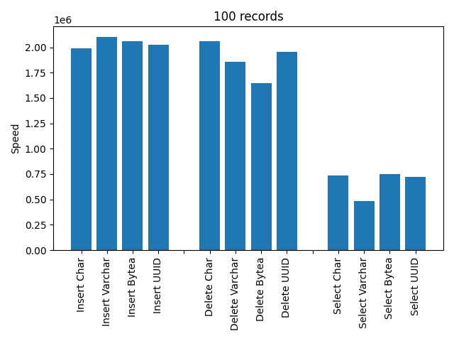
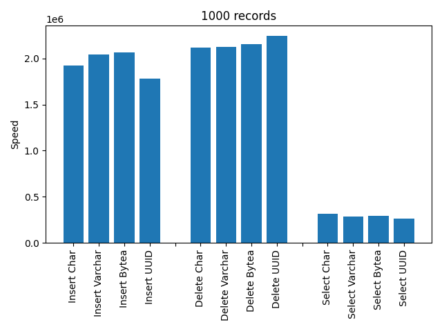
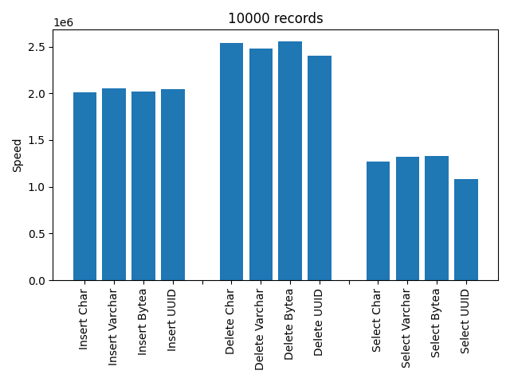
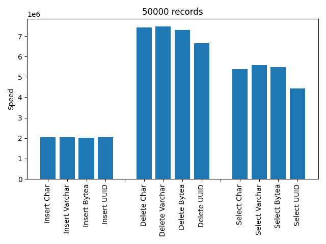
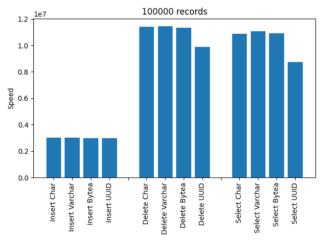
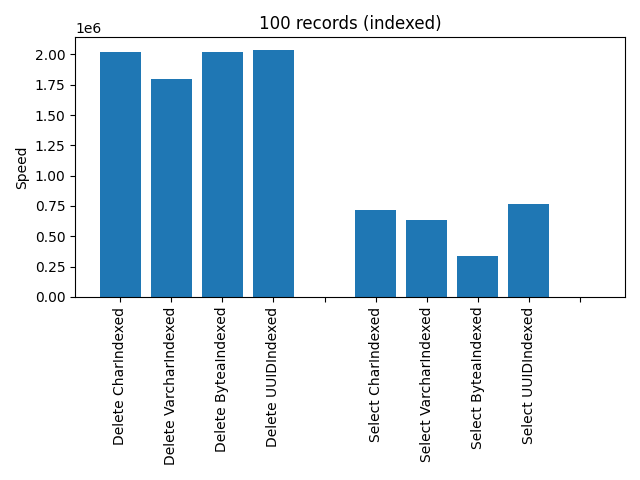
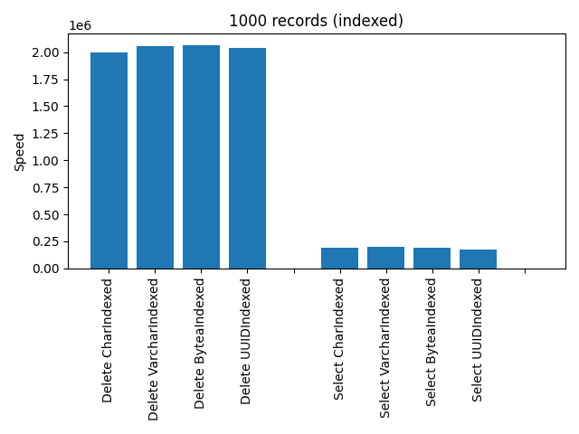
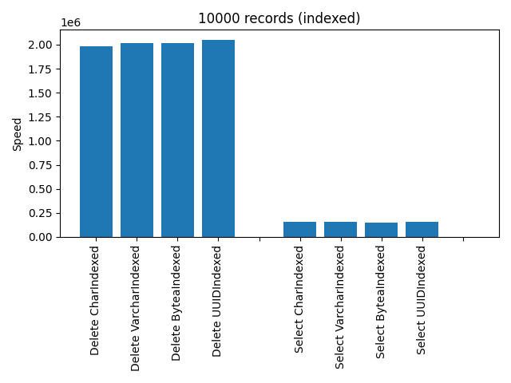
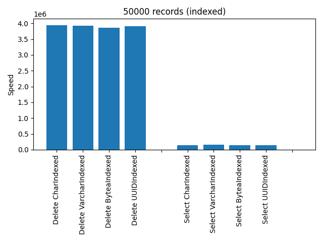
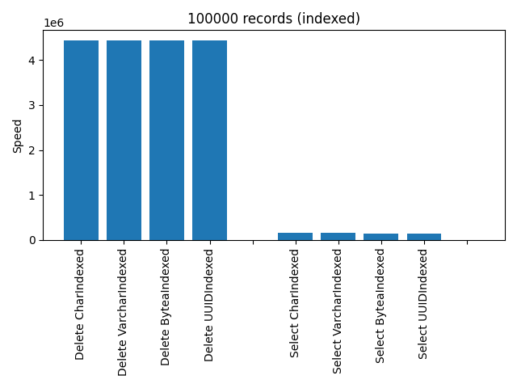

# Storing cluster names in database

---

## Cluster name

* represented as UUID
    - 128bit value (16 bytes)
    - displayed as \
      `123e4567-e89b-12d3-a456-426614174000` \
      (36 characters)
    - processed as string (JSON, ...)

---

## Cluster name

* how to store it in PostgreSQL?
    - `char(36)`
    - `varchar(36)`
    - `bytea`
    - `uuid`

---

## Why bother?

* DB size
    - `char`: 36 bytes per record
    - `varchar`: 1 byte + 36=37 bytes per record
    - `bytea`: 1 byte + 36/2=19 bytes per record
    - `uuid`: 32/2=16 bytes per record \
      (automatically converted to/from char)

---

## Why bother?

* Performance
    - `column_name` is used in indices
    - so it's stored separately in B-tree or similar structure
    - and size matters there
    - (number of blocks stored in memory, number of block read for each query)

---

### Where it is used?

* Aggregator DB
* Notification service DB
* Parquet files (not relevant there)

---

### Aggregator DB

* Several tables
    - report
    - rule_hit
    - cluster_rule_user_feedback
    - cluster_rule_toggle
    - cluster_user_rule_disable_feedback
    - recommendation

---

### Notification service DB

* Several tables
    - new_reports
    - reported
    - read_errors

---

## Theory

* `uuid` might be the best option 
* `bytea` might be a bit worse
* `char` on third place
* `varchar` on the last place

---

## Don't trust theory...until proven

* Use real table schema
* Use real SQL statements
* Cluster names column should be part of compound primary key
* Additionally we can try to add a new index

---

## Table schema

```sql
CREATE TABLE IF NOT EXISTS reported_benchmark_1 (
    org_id            integer not null,
    account_number    integer not null,
    cluster           character(36) not null,
                      -- varchar, bytea, uuid
    notification_type integer not null,
    state             integer not null,
    report            varchar not null,
    updated_at        timestamp not null,
    notified_at       timestamp not null,
    error_log         varchar,

    PRIMARY KEY (org_id, cluster, notified_at)
);
```

---

### SQL statements

```sql
SELECT org_id, account_number, notification_type, state, report, updated_at, notified_at, error_log
  FROM reported_benchmark_1
 WHERE cluster=$1
```

```sql
INSERT
  INTO reported_benchmark_1
(org_id, account_number, cluster, notification_type, state, report, updated_at, notified_at, error_log)
VALUES ($1, $2, $3, $4, $5, $6, $7, $8, $9)
```

```sql
DELETE
  FROM reported_benchmark_1
 WHERE cluster=$1
```

---

### Benchmarks implementation

[uuid_column_test.go](https://github.com/RedHatInsights/ccx-notification-service/blob/master/docs/demos/uuid_column_in_db/demo/uuid_column_test.go)

---

### Small tables with 100 records

* Just to quick check if benchmark works

```
goos: linux
goarch: amd64
pkg: github.com/RedHatInsights/ccx-notification-service
BenchmarkInsertClusterAsChar-8          100      1990038 ns/op
BenchmarkInsertClusterAsVarchar-8       100      2099556 ns/op
BenchmarkInsertClusterAsBytea-8         100      2060851 ns/op
BenchmarkInsertClusterAsUUID-8          100      2024153 ns/op
BenchmarkDeleteClusterAsChar-8          100      2058986 ns/op
BenchmarkDeleteClusterAsVarchar-8       100      1855351 ns/op
BenchmarkDeleteClusterAsBytea-8         100      1645019 ns/op
BenchmarkDeleteClusterAsUUID-8          100      1955547 ns/op
BenchmarkSelectClusterAsChar-8          100       738880 ns/op
BenchmarkSelectClusterAsVarchar-8       100       487008 ns/op
BenchmarkSelectClusterAsBytea-8         100       751563 ns/op
BenchmarkSelectClusterAsUUID-8          100       725236 ns/op
PASS
ok      github.com/RedHatInsights/ccx-notification-service      2884.159s
```

---



---

### Medium tables with 1000 records

* Possible speedup won't be much visible there

```
goos: linux
goarch: amd64
pkg: github.com/RedHatInsights/ccx-notification-service
BenchmarkInsertClusterAsChar-8         1000      1926411 ns/op
BenchmarkInsertClusterAsVarchar-8      1000      2045086 ns/op
BenchmarkInsertClusterAsBytea-8        1000      2063993 ns/op
BenchmarkInsertClusterAsUUID-8         1000      1783965 ns/op
BenchmarkDeleteClusterAsChar-8         1000      2117746 ns/op
BenchmarkDeleteClusterAsVarchar-8      1000      2129500 ns/op
BenchmarkDeleteClusterAsBytea-8        1000      2156378 ns/op
BenchmarkDeleteClusterAsUUID-8         1000      2244083 ns/op
BenchmarkSelectClusterAsChar-8         1000       313019 ns/op
BenchmarkSelectClusterAsVarchar-8      1000       288332 ns/op
BenchmarkSelectClusterAsBytea-8        1000       294040 ns/op
BenchmarkSelectClusterAsUUID-8         1000       262347 ns/op
PASS
ok      github.com/RedHatInsights/ccx-notification-service      2914.665s
```

---



---

### Larger tables with 10000 records

```
goos: linux
goarch: amd64
pkg: github.com/RedHatInsights/ccx-notification-service
BenchmarkInsertClusterAsChar-8        10000      2006754 ns/op
BenchmarkInsertClusterAsVarchar-8     10000      2051222 ns/op
BenchmarkInsertClusterAsBytea-8       10000      2019572 ns/op
BenchmarkInsertClusterAsUUID-8        10000      2042202 ns/op
BenchmarkDeleteClusterAsChar-8        10000      2539460 ns/op
BenchmarkDeleteClusterAsVarchar-8     10000      2474926 ns/op
BenchmarkDeleteClusterAsBytea-8       10000      2552969 ns/op
BenchmarkDeleteClusterAsUUID-8        10000      2402486 ns/op
BenchmarkSelectClusterAsChar-8        10000      1269443 ns/op
BenchmarkSelectClusterAsVarchar-8     10000      1323098 ns/op
BenchmarkSelectClusterAsBytea-8       10000      1332636 ns/op
BenchmarkSelectClusterAsUUID-8        10000      1080828 ns/op
PASS
ok      github.com/RedHatInsights/ccx-notification-service      6151.486s
```
---



---

### Huge tables with 50000 records

* Aprox. number of records stored in real Aggregator database

```
goos: linux
goarch: amd64
pkg: github.com/RedHatInsights/ccx-notification-service
BenchmarkInsertClusterAsChar-8        50000      2044506 ns/op
BenchmarkInsertClusterAsVarchar-8     50000      2037891 ns/op
BenchmarkInsertClusterAsBytea-8       50000      2020112 ns/op
BenchmarkInsertClusterAsUUID-8        50000      2037548 ns/op
BenchmarkDeleteClusterAsChar-8        50000      7413309 ns/op
BenchmarkDeleteClusterAsVarchar-8     50000      7466647 ns/op
BenchmarkDeleteClusterAsBytea-8       50000      7296210 ns/op
BenchmarkDeleteClusterAsUUID-8        50000      6645221 ns/op
BenchmarkSelectClusterAsChar-8        50000      5375757 ns/op
BenchmarkSelectClusterAsVarchar-8     50000      5579126 ns/op
BenchmarkSelectClusterAsBytea-8       50000      5480033 ns/op
BenchmarkSelectClusterAsUUID-8        50000      4437253 ns/op
PASS
ok      github.com/RedHatInsights/ccx-notification-service      9470.518s
```
---



---

### Huge tables with 100000 records

* Aprox. number of records stored in real Notification Service database

```
goos: linux
goarch: amd64
pkg: github.com/RedHatInsights/ccx-notification-service
BenchmarkInsertClusterAsChar-8       100000      3030527 ns/op
BenchmarkInsertClusterAsVarchar-8    100000      3019363 ns/op
BenchmarkInsertClusterAsBytea-8      100000      2962184 ns/op
BenchmarkInsertClusterAsUUID-8       100000      2988198 ns/op
BenchmarkDeleteClusterAsChar-8       100000     11399657 ns/op
BenchmarkDeleteClusterAsVarchar-8    100000     11439103 ns/op
BenchmarkDeleteClusterAsBytea-8      100000     11334972 ns/op
BenchmarkDeleteClusterAsUUID-8       100000      9881923 ns/op
BenchmarkSelectClusterAsChar-8       100000     10860747 ns/op
BenchmarkSelectClusterAsVarchar-8    100000     11064993 ns/op
BenchmarkSelectClusterAsBytea-8      100000     10914949 ns/op
BenchmarkSelectClusterAsUUID-8       100000      8749562 ns/op
PASS
ok      github.com/RedHatInsights/ccx-notification-service      17928.382s
```

---



---

## Cluster names column as index

```sql
CREATE INDEX IF NOT EXISTS reported_benchmark_1_cluster_idx
                        ON reported_benchmark_1
                     USING btree (cluster);
```

---

### Small tables with 100 records

```
BenchmarkDeleteClusterAsCharIndexed-8        100   2024163 ns/op
BenchmarkDeleteClusterAsVarcharIndexed-8     100   1800105 ns/op
BenchmarkDeleteClusterAsByteaIndexed-8       100   2019889 ns/op
BenchmarkDeleteClusterAsUUIDIndexed-8        100   2039386 ns/op
BenchmarkSelectClusterAsCharIndexed-8        100    716129 ns/op
BenchmarkSelectClusterAsVarcharIndexed-8     100    637573 ns/op
BenchmarkSelectClusterAsByteaIndexed-8       100    339237 ns/op
BenchmarkSelectClusterAsUUIDIndexed-8        100    765160 ns/op
```

---



---

### Medium tables with 1000 records

```
goos: linux
goarch: amd64
pkg: github.com/RedHatInsights/ccx-notification-service
BenchmarkDeleteClusterAsCharIndexed-8       1000   1993100 ns/op
BenchmarkDeleteClusterAsVarcharIndexed-8    1000   2059622 ns/op
BenchmarkDeleteClusterAsByteaIndexed-8      1000   2066688 ns/op
BenchmarkDeleteClusterAsUUIDIndexed-8       1000   2041433 ns/op
BenchmarkSelectClusterAsCharIndexed-8       1000    191250 ns/op
BenchmarkSelectClusterAsVarcharIndexed-8    1000    201501 ns/op
BenchmarkSelectClusterAsByteaIndexed-8      1000    192396 ns/op
BenchmarkSelectClusterAsUUIDIndexed-8       1000    171307 ns/op
PASS
ok      github.com/RedHatInsights/ccx-notification-service      3865.170s
```

---



---

### Larger tables with 10000 records

```
goos: linux
goarch: amd64
pkg: github.com/RedHatInsights/ccx-notification-service
BenchmarkDeleteClusterAsCharIndexed-8      10000   1985390 ns/op
BenchmarkDeleteClusterAsVarcharIndexed-8   10000   2016402 ns/op
BenchmarkDeleteClusterAsByteaIndexed-8     10000   2017756 ns/op
BenchmarkDeleteClusterAsUUIDIndexed-8      10000   2052270 ns/op
BenchmarkSelectClusterAsCharIndexed-8      10000    157450 ns/op
BenchmarkSelectClusterAsVarcharIndexed-8   10000    156115 ns/op
BenchmarkSelectClusterAsByteaIndexed-8     10000    149408 ns/op
BenchmarkSelectClusterAsUUIDIndexed-8      10000    154142 ns/op
PASS
ok      github.com/RedHatInsights/ccx-notification-service      4089.958s

```

---



---

### Huge tables with 50000 records

```
goos: linux
goarch: amd64
pkg: github.com/RedHatInsights/ccx-notification-service
BenchmarkDeleteClusterAsCharIndexed-8      50000   3943668 ns/op
BenchmarkDeleteClusterAsVarcharIndexed-8   50000   3920540 ns/op
BenchmarkDeleteClusterAsByteaIndexed-8     50000   3853470 ns/op
BenchmarkDeleteClusterAsUUIDIndexed-8      50000   3908516 ns/op
BenchmarkSelectClusterAsCharIndexed-8      50000    145972 ns/op
BenchmarkSelectClusterAsVarcharIndexed-8   50000    152372 ns/op
BenchmarkSelectClusterAsByteaIndexed-8     50000    147668 ns/op
BenchmarkSelectClusterAsUUIDIndexed-8      50000    145055 ns/op
PASS
ok      github.com/RedHatInsights/ccx-notification-service      5472.322s
```

---



---

### Huge tables with 100000 records

```
goos: linux
goarch: amd64
pkg: github.com/RedHatInsights/ccx-notification-service
BenchmarkDeleteClusterAsCharIndexed-8     100000   4438956 ns/op
BenchmarkDeleteClusterAsVarcharIndexed-8  100000   4436202 ns/op
BenchmarkDeleteClusterAsByteaIndexed-8    100000   4434197 ns/op
BenchmarkDeleteClusterAsUUIDIndexed-8     100000   4433377 ns/op
BenchmarkSelectClusterAsCharIndexed-8     100000    151399 ns/op
BenchmarkSelectClusterAsVarcharIndexed-8  100000    152682 ns/op
BenchmarkSelectClusterAsByteaIndexed-8    100000    144385 ns/op
BenchmarkSelectClusterAsUUIDIndexed-8     100000    143342 ns/op
PASS
ok      github.com/RedHatInsights/ccx-notification-service      8082.365s
```

---



---

### Problems that has been solved

* Delay between tests to "fix" DB vacuuming issue
* Total test time
    - by default benchmarks are killed after 10 minutes

---

### Conclusion (1/2)

* Don't trust the theory in IT :)
    - a lot of unknowns play role
* UUID data type will improve database performance a bit
    - especially for compound keys
    - on the other hand it is not 2x, 3x speedup
* When cluster names are stored in separate index
    - no measurable performance improvement

---

### Conclusion (2/2)

* This change is
    - fully transparent
* Which means
    - no updates of program code
    - no updates in tests etc.
    - OTOH migration needs to be done
* Decision has not been made (yet)

---

## Links

* [Character Types in PostgreSQL](https://www.postgresql.org/docs/current/datatype-character.html)
* [Binary Data Types in PostgreSQL](https://www.postgresql.org/docs/current/datatype-binary.html)
* [UUID Type](https://www.postgresql.org/docs/current/datatype-uuid.html)
* [uuid_column_test.go](https://github.com/RedHatInsights/ccx-notification-service/blob/master/docs/demos/uuid_column_in_db/demo/uuid_column_test.go)
* [Optimizing Storage and Managing Cleanup in PostgreSQL](https://medium.com/coding-blocks/optimizing-storage-and-managing-cleanup-in-postgresql-c2fe56d4cf5)
* [Optimizing and shrinking reported table for CCX Notification Service](https://redhatinsights.github.io/ccx-notification-service/demos/shrinking_report_table/shringink_report_table.html)
* [Usage of DB indexes to optimize data throughput in CCX Notification Service](https://redhatinsights.github.io/ccx-notification-service/demos/db-indexes/db-indexes.html)
* [4 Ways To Optimise PostgreSQL Database With Millions of Data](https://medium.com/geekculture/4-ways-to-optimise-postgresql-database-with-millions-of-data-c70e11d27a94)
