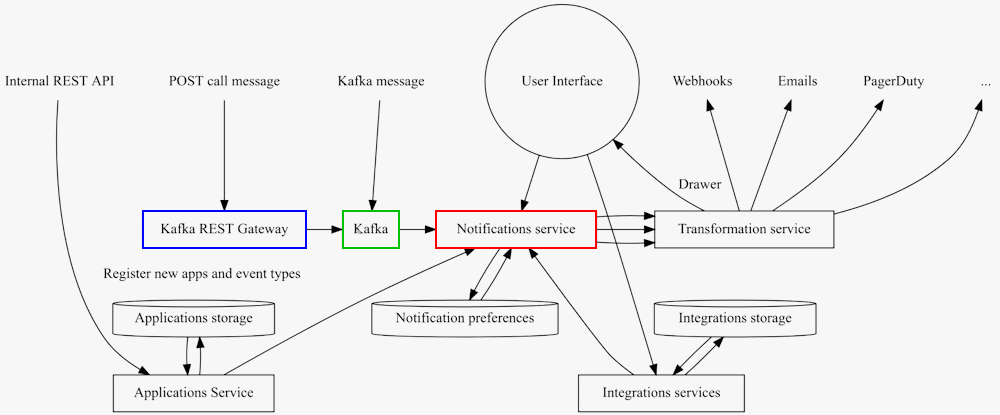
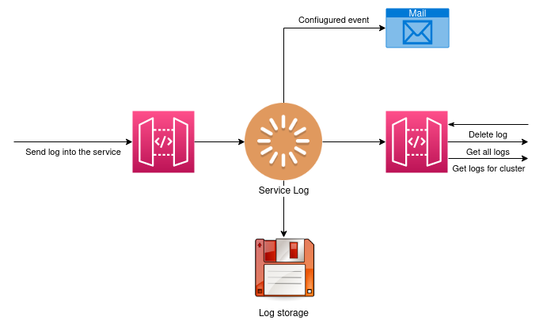

# Event targets

Currently two event targets can be configured:

1. Notification backend via Kafka topic
1. ServiceLog via REST API


## Notification backend

Events are sent into the Kafka topic provided by Notification service.
Alternatively it is possible to use REST API (or rather REST API Gateway) for
applications that reside outside cloud.redhat.com and/or can’t access Kafka
topic directly.



Events are processed by the notification service and after filtering they are
sent to the so-called transformation service for further processing.

There the templating is done (the event itself contains basically a set of
key+values pairs) and messages are sent to customers/users via pre-defined
channels like webhooks, e-mails, Slack (planned for the future etc.)

The event itself is represented as JSON with a set of key-value pairs. These
values are then used by template engine (Transformation service) to produce
user-readable description, for example a new email.

The event types are the most atomic piece of information handled by the
notification service, and it is recommended to keep their number for a given
application to the lowest (for ease of use of the application mostly).


## ServiceLog

OCM Service Log or OSL is a micro-service that ingests logs related to specific
clusters from various internal services and stores them for internal and
external consumption.



Log entries are created against a particular UUID. They include a
summary/title, a description, a timestamp of when the event occurred, and a
severity. This is an example how log entry could look like:

```json
{
    "severity": "Info",
    "service_name": "Insights",
    "cluster_uuid": "d484b150-3106-4d6a-96b4-e03c327a2f66",
    "summary": "Subscription created",
    "description": "Following issues have been found…",
    "internal_only": false,
    "timestamp": "2022-07-12T07:08:09Z",
    "event_stream_id":"1gKkRgiC5dCUJ7PxTPbn8J4FjGa"
}
```

### Formats and styles in description field

The description field of logs supports markdown formatting and it is encouraged
to use it.

### Log record structure for creating new log record

#### Schema

```json
{
    href            string
    id              string
    kind            string
    cluster_id      string
    cluster_uuid    string
    Created_at      string($date-time)
    created_by      string
    description     string
    email           string
    event_stream_id string
    first_name      string
    internal_only   boolean
                    default: false
    last_name       string
    service_name    string
    severity        stringEnum:
                    [ Debug, Info, Warning, Error, Fatal ]
    subscription_id string
    summary         string
    Timestamp       string($date-time)
    username        string
}
```

#### Example - JSON with all optional fields

```json
{
  "href": "string",
  "id": "string",
  "kind": "string",
  "cluster_id": "string",
  "cluster_uuid": "string",
  "created_at": "2022-07-11T16:44:27.146Z",
  "created_by": "string",
  "description": "string",
  "email": "string",
  "event_stream_id": "string",
  "first_name": "string",
  "internal_only": false,
  "last_name": "string",
  "service_name": "string",
  "severity": "Debug",
  "subscription_id": "string",
  "summary": "string",
  "timestamp": "2022-07-11T16:44:27.146Z",
  "username": "string"
}
```
