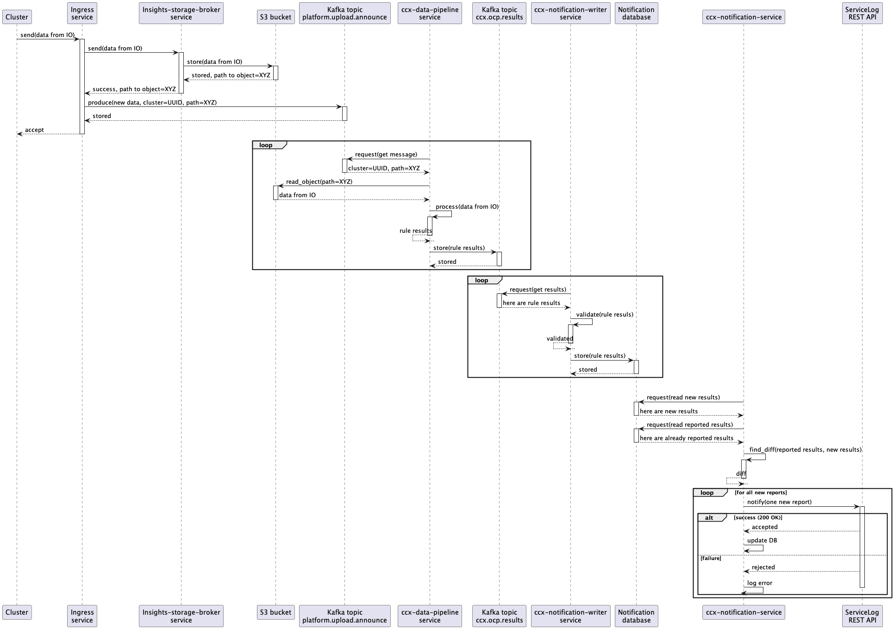
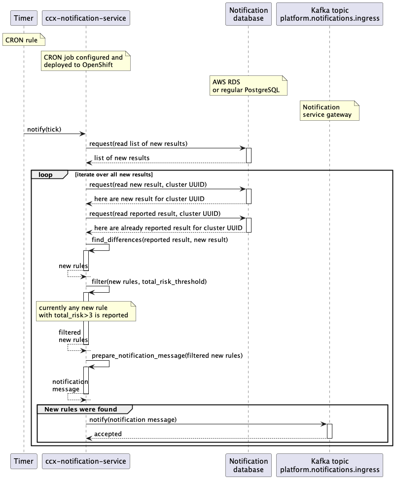
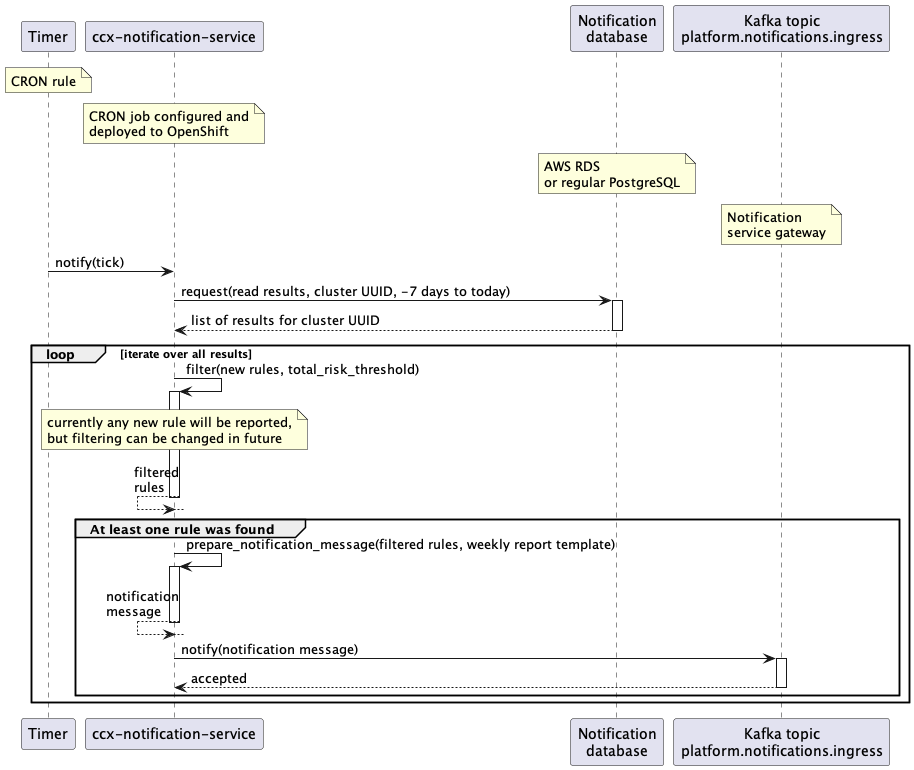

# Description

CCX Notification Service

## Architecture

[Architecture diagram, full scale](architecture_diagram.png)

## Data flow

The "end-to-end" data flow is described there (including Notification Writer service part):

1. A customer cluster with *Insights Operator* installed sends new data containing info about the cluster into *Ingress service*
1. The *Ingress service* consumes the data, writes them into an S3 Bucket, and produces a new message into a Kafka topic named `platform.upload.buckit`.
1. The *CCX Data pipeline* service consumes the message from the `platform.upload.buckit` Kafka topic.
1. That message represents an event that contains (among other things) an URL to S3 Bucket.
1. Insights operator data is read from S3 Bucket and *insights rules* are applied to that data in `ccx-data-pipeline` service.
1. Results (basically `organization ID` + `cluster name` + `insights results JSON`) are stored back into Kafka, but into different topic named `ccx.ocp.results`.
1. That results are consumed by `ccx-notification-writer` service.
1. `ccx-notification-writer` service stores insights results into AWS RDS database into `new_reports` table.
1. Content of that table is consumed by `ccx-notification-service` periodically.
1. Newest results from `new_reports` table is compared with results stored in `reported` table. The records used for the comparison depend on the configured cooldown time.
1. If changes (new issues) has been found, notification message is sent into Kafka topic named `platform.notifications.ingress`. The expected format of the message can be found [here](https://core-platform-apps.pages.redhat.com/notifications-docs/dev/user-guide/send-notification.html#_kafka).
1. New issues is also sent to Service Log via REST API. To use the Service Log API, the `ccx-notification-service` uses the credentials stored in [vault](https://vault.devshift.net/ui/vault/secrets/insights/show/secrets/insights-prod/ccx-data-pipeline-prod/ccx-notification-service-auth).
1. The newest result is stored into `reported` table to be used in the next `ccx-notification-service` iteration.

### Remarks

1. Steps 1 to  5 are shared with the CCX Data pipeline
1. Steps 7 and 8 are performed by `ccx-notification-writer` service.
1. Steps 9 to 12 are performed by `ccx-notification-service` service.

## Notification templates

Notification templates used to send e-mails etc. to customers are stored in different repository:
[https://github.com/RedHatInsights/notifications-backend/](https://github.com/RedHatInsights/notifications-backend/)

Templates used by this notification service are available at:
[https://github.com/RedHatInsights/notifications-backend/tree/master/backend/src/main/resources/templates/AdvisorOpenshift](https://github.com/RedHatInsights/notifications-backend/tree/master/backend/src/main/resources/templates/AdvisorOpenshift)

## Class diagram

[Class diagram, full scale](class_diagram.png)

## Sequence diagram for the whole pipeline - notification service integration

[Sequence diagram, full scale](sequence_diagram.png)

## Sequence diagram for the whole pipeline - Service Log integration

[Sequence diagram, full scale](sequence_diagram._service_logpng)

## Sequence diagram for instant reports

[Full scale](instant_reports.png)

## Sequence diagram for weekly reports

[Full scale](weekly_reports.png)

## Sequence diagram for CCX Notification Writer service

[Sequence diagram for CCX Notification Writer service](sequence_diagram_notification_writer.png)

## Database description

* PostgreSQL database is used as a storage.
* Database description is available [here](./db-description/index.html)

## Documentation for source files from this repository

* [ccx_notification_service.go](./packages/ccx_notification_service.html)
* [conf/config.go](./packages/conf/config.html)
* [differ/comparator.go](./packages/differ/comparator.html)
* [differ/content.go](./packages/differ/content.html)
* [differ/differ.go](./packages/differ/differ.html)
* [differ/storage.go](./packages/differ/storage.html)
* [producer/producer](./packages/producer/producer.html)
* [producer/kafka_producer.go](./packages/producer/kafka_producer.html)
* [types/types.go](./packages/types/types.html)

## Documentation for unit tests files for this repository

* [conf/configuration_test.go](./packages/conf/configuration_test.html)
* [differ/comparator_test.go](./packages/differ/comparator_test.html)
* [differ/differ_test.go](./packages/differ/differ_test.html)
* [producer/producer_test.go](./packages/producer/producer_test.html)
* [tests/mocks/Producer.go](./packages/tests/mocks/Producer.html)
* [tests/mocks/Storage.go](./packages/tests/mocks/Storage.html)

## Cooldown mechanism

The cooldown mechanism is used to filter the previously reported issues so that they are not continuously sent to the customers. It works by defining a miminum amount of time that must elapse between two notifications. That cooldown time is applied to all the issues processed during an iteration.

### Data flow of the notification service without cooldown

See steps 9 to 12 of the [data flow section](#data-flow)

### Data flow of the notification service with cooldown

1. The latest entry for each distinct cluster in the `new_reports` table is consumed by the `ccx-notification-service`.
1. Results stored in `reported` table within the cooldown time are retrieved. Therefore all the reported issues that are not older than the configured cooldown are cached in a `previouslyReported` map by the service in each iteration.
1. When checking for new issues in the report, the `ccx-notification-service` looks up each issue in the `previouslyReported` map, and if found, that issue is considered to still be in cooldown and is not processed further. If not found, the processing of the issue continues.
1. If changes (new issues) has been found between the previous report and the new one, a notification message is sent into Kafka topic named `platform.notifications.ingress`. The expected format of the message can be found [here](https://core-platform-apps.pages.redhat.com/notifications-docs/dev/user-guide/send-notification.html#_kafka).
1. New issues is also sent to Service Log via REST API. To use the Service Log API, the `ccx-notification-service` uses the credentials stored in [vault](https://vault.devshift.net/ui/vault/secrets/insights/show/secrets/insights-prod/ccx-data-pipeline-prod/ccx-notification-service-auth).
1. The newest result is stored into `reported` table to be used in the next `ccx-notification-service` iteration.

### Configuring the cooldown mechanism

The cooldown mechanism can be configured by specifying the `cooldown` field under the `notifications` configuration in the [config.toml](../config.toml) file or by setting the `CCX_NOTIFICATION_SERVICE__NOTIFICATIONS__COOLDOWN` environment variable.

The value set is used directly within an SQL query, so the expected format is an integer followed by a valid SQL epoch time units (year[s] month[s] day[s] hour[s] minute[s] second[s])
