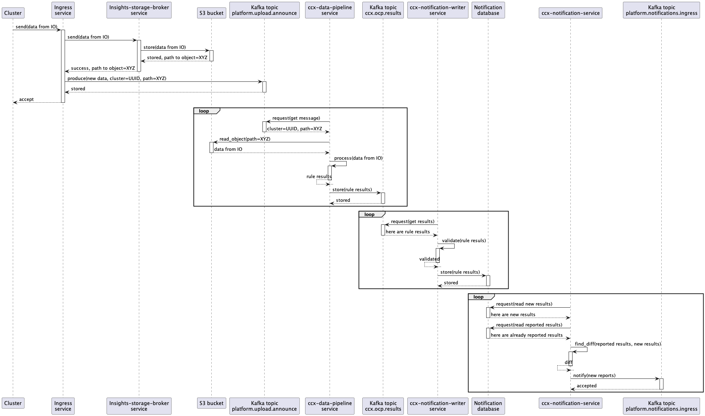

# Description

CCX Notification Service

## Architecture

[Architecture diagram, full scale](architecture_diagram.png)

## Class diagram

[Class diagram, full scale](class_diagram.png)

## Sequence diagram

[Sequence diagram, full scale](sequence_diagram.png)

## Database description

* PostgreSQL database is used as a storage.
* Database description is available [here](./db-description/index.html)

## Documentation for source files from this repository

* [ccx_notification_service.go](./packages/ccx_notification_service.html)

