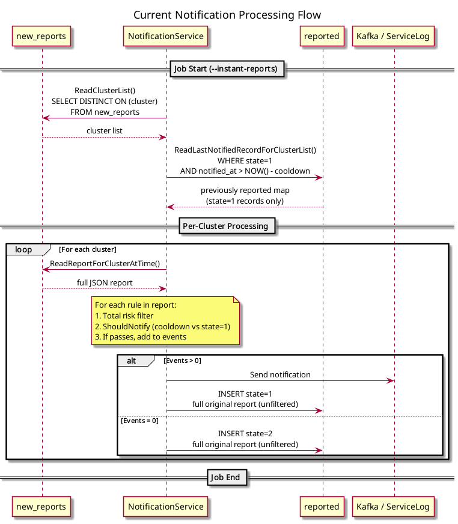
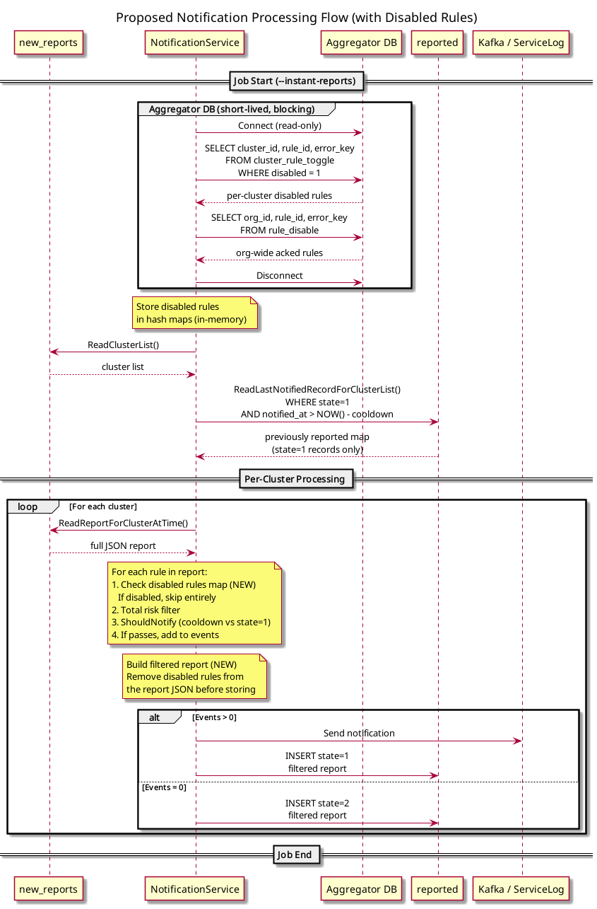

# Disabled Rules in CCX Notification Service

## 1. Overview

Customers can disable individual OCP Advisor rules to stop being notified about them. There are two mechanisms:

- **Per-cluster disable** (`cluster_rule_toggle` table in the aggregator DB): a user disables a specific rule for a specific cluster. Re-enabling sets the `disabled` flag back to `0`.
- **Org-wide rule ack** (`rule_disable` table in the aggregator DB): a user acknowledges a rule across all clusters in their organization. Re-enabling deletes the row.

The notification service (`ccx-notification-service`) currently does not check these tables. This design adds support for both, with correct re-enable and cooldown behavior.

**Scope**: the changes affect only the shared processing loop in the `differ` package. There are no Kafka-specific or ServiceLog-specific changes, and no changes to the cooldown logic.

## 2. Current Architecture

### How the notification service works

The service runs as a periodic CronJob with the `--instant-reports` flag. It reads from two databases:

- **Notification DB** (its own): `new_reports` (input) and `reported` (processing log)
- **Aggregator DB** (shared with insights-results-aggregator): contains the rule disable tables. This is a new dependency introduced by this feature.

### Tables

#### `new_reports` (Notification DB)

Input queue, populated by `ccx-notification-writer` consuming from the `ccx.ocp.results` Kafka topic.

```sql
CREATE TABLE new_reports (
    org_id          integer NOT NULL,
    account_number  integer NOT NULL,
    cluster         character(36) NOT NULL,
    report          varchar NOT NULL,      -- full JSON report with all rule hits
    updated_at      timestamp NOT NULL,
    kafka_offset    bigint NOT NULL
);
```

#### `reported` (Notification DB)

Append-only processing log. A new row is inserted on every run per cluster and it is never updated in place.

```sql
CREATE TABLE reported (
    org_id             integer NOT NULL,
    account_number     integer NOT NULL,
    cluster            character(36) NOT NULL,
    notification_type  integer NOT NULL,
    state              integer NOT NULL,      -- 1=sent, 2=same, 3=lower, 4=error
    report             varchar NOT NULL,      -- full JSON report (currently unfiltered)
    updated_at         timestamp NOT NULL,
    notified_at        timestamp NOT NULL,
    error_log          varchar,
    event_type_id      integer NOT NULL,      -- 1=Kafka, 2=ServiceLog

    PRIMARY KEY (org_id, cluster, notified_at)
);
```

The `state` column records the processing outcome:

| State | Value   | Meaning |
|-------|---------|---------|
| 1     | `sent`  | Notification delivered to customer |
| 2     | `same`  | Skipped, no new issues compared to previously reported |
| 3     | `lower` | Skipped, all issues below threshold |
| 4     | `error` | Delivery failed |

The `event_type_id` column tracks the notification target. Kafka and ServiceLog cooldowns are independent, so a Kafka notification does not put a ServiceLog notification in cooldown or vice versa (see `service_log.feature`, scenario "Kafka related rows in reported table do not affect notifications sent to service log").

#### `cluster_rule_toggle` (Aggregator DB)

Per-cluster rule disable. The `disabled` column is a flag: `1` = disabled, `0` = re-enabled.

```sql
CREATE TABLE cluster_rule_toggle (
    cluster_id  VARCHAR NOT NULL,
    rule_id     VARCHAR NOT NULL,
    user_id     VARCHAR NOT NULL,
    disabled    SMALLINT NOT NULL,
    disabled_at TIMESTAMP NULL,
    enabled_at  TIMESTAMP NULL,
    updated_at  TIMESTAMP NOT NULL,
    error_key   VARCHAR NOT NULL
);
```

Note that `rule_id` and `error_key` are separate columns here, unlike the composite `rule_id|error_key` format used in the report JSON.

#### `rule_disable` (Aggregator DB)

Org-wide rule ack. The presence of a row means the rule is disabled. Re-enabling deletes the row.

```sql
CREATE TABLE rule_disable (
    org_id        VARCHAR NOT NULL,
    user_id       VARCHAR NOT NULL,
    rule_id       VARCHAR NOT NULL,
    error_key     VARCHAR NOT NULL,
    justification VARCHAR,
    created_at    TIMESTAMP,
    updated_at    TIMESTAMP
);
```

### Processing loop

The core logic lives in `processReportsByCluster` (`differ.go:561`). Simplified:

```
For each cluster from ReadClusterList() (reads from new_reports):
    1. Read report from new_reports (ReadReportForClusterAtTime)
    2. Deserialize JSON into individual rule items
    3. If zero rules, skip entirely (no write to reported)
    4. For each rule:
       a. Calculate total risk from content service metadata
       b. Evaluate filter: totalRisk >= threshold (default 2)
       c. If passes, check ShouldNotify (cooldown comparison)
       d. If should notify, add to notification message
    5. If 0 qualifying events, write state=2 ("same") to reported
    6. If events > 0, send to Kafka/ServiceLog and write state=1 ("sent") to reported
```

The `report` column in `reported` currently stores the **full original report** from `new_reports` and is never filtered. All rules are stored regardless of whether they were notified, skipped by cooldown, or below threshold.

### ShouldNotify (cooldown)

`ShouldNotify` (`comparator.go:88`) determines whether a specific rule should trigger a notification. It is called **per-rule**, not per-cluster:

1. Look up the cluster in `PreviouslyReported`, a map loaded once at startup via `ReadLastNotifiedRecordForClusterList` (`storage.go:627`).
2. If no previous record exists (cooldown expired or first time), **notify**.
3. If a record exists, deserialize its stored report and call `IssueNotInReport` (`comparator.go:158`), which compares rules by **Type, Module, and ErrorKey** (not by Details).
4. If the rule is found in the old report, **skip** (already reported, in cooldown).
5. If the rule is NOT found, **notify** (new issue).

The cooldown query reads **state=1 ("sent") only**. State=2 records are completely invisible to the cooldown mechanism.

```sql
SELECT org_id, cluster, report, notified_at
FROM (SELECT DISTINCT ON (cluster) * FROM reported
      WHERE event_type_id = $target AND state = 1
        AND org_id IN (...) AND cluster IN (...)
      ORDER BY cluster, notified_at DESC) t
WHERE notified_at > NOW() - $cooldown::INTERVAL;
```

### Notification delivery

- **Kafka**: one message per cluster containing multiple events (one per qualifying rule). `ProduceMessage` is called once per cluster.
- **ServiceLog**: one REST call per qualifying rule via `createAndSendServiceLogEntry`. Each rule is rendered through the template renderer.

Both paths share the same filtering pipeline, and the disabled rules check will be added in the shared loop rather than in the target-specific code.

## 3. Current Flow



PlantUML source: [docs/disabled_rules_current_flow.puml](./disabled_rules_current_flow.puml)

## 4. Proposed Changes

Two changes in the shared processing loop. No changes to `ShouldNotify`, cooldown logic, or target-specific code.

### Change A: Fetch and filter disabled rules

As the very first step of each job run, before reading the cluster list or any other data, the service connects to the aggregator DB and fetches all disabled rules into memory. This is a **blocking** operation, meaning nothing else proceeds until the disabled rules are fully loaded. If the aggregator DB is unavailable, the job fails immediately without having consumed any other resources. This step is skipped entirely when the `--ignore-disabled-rules` flag is set (see below).

Two queries are executed:

- `SELECT cluster_id, rule_id, error_key FROM cluster_rule_toggle WHERE disabled = 1` into a hash map keyed by `(cluster_id, rule_id, error_key)`
- `SELECT org_id, rule_id, error_key FROM rule_disable` into a hash map keyed by `(org_id, rule_id, error_key)`

We only need the key columns for lookups. Timestamps, user IDs, and justifications are not needed at runtime.

**Why fetch everything at startup?** The total number of disabled rules in production is around 35k rows. With only 3 key columns per row, this is roughly 4MB to transfer and 6MB to store in Go structs, which is negligible memory usage. Even 10x growth would not be a concern. Fetching everything once avoids per-cluster DB round-trips during processing.

**Why blocking?** The notification jobs run every ~15 minutes and typically take around 5 minutes to complete. If a user disables a rule while the job is running, they will still be notified about it in the current batch. This is intentional: disabling a rule mid-run would cause some clusters to be notified and others not, which would break consistency within a single batch. By loading disabled rules once at startup, every cluster in the batch is processed against the same set of disabled rules.

**Aggregator DB connection lifecycle.** The connection to the aggregator DB is established at startup, the two queries are executed, and the connection is terminated immediately after. The aggregator DB is not kept open during the per-cluster processing loop, which minimizes the impact on it (a small burst of reads at startup, then nothing).

In the per-rule processing loop, add a disabled check **before** the total risk filter:

```
For each rule:
    1. Is this rule disabled? (check in-memory maps for cluster_rule_toggle AND rule_disable)
       If yes, skip entirely
    2. Calculate total risk, evaluate filter
    3. ShouldNotify check
    4. Add to notification message
```

The in-memory hash map lookups have constant time complexity (O(1)), so the performance impact on the per-rule loop is negligible.

This check needs to be added in both:
- `produceEntriesToKafka` (`differ.go:459`) for the Kafka path
- `getReportsWithIssuesToNotify` (`differ.go:320`) for the ServiceLog path

Both functions have the same duplicated filtering logic (noted by the `//TODO: Duplicated` comment at `differ.go:334`).

### Change B: Omit disabled rules from stored reports

When writing to the `reported` table, omit disabled rules from the `report` column:

1. Deserialize the original report JSON
2. Remove entries where `(cluster_id, rule_id, error_key)` is in `cluster_rule_toggle` or `(org_id, rule_id, error_key)` is in `rule_disable`
3. Re-serialize to JSON
4. Pass the filtered JSON to `WriteNotificationRecordForCluster`

This changes the comparison baseline for future `ShouldNotify` calls. When a rule is re-enabled, it will not be in the stored report, so `IssueNotInReport` returns true and the rule is treated as a new issue. The customer then gets notified.

**This is the key mechanism that makes re-enable detection work without any changes to the cooldown logic.**

### New dependency: Aggregator DB connection

The notification service currently connects only to the notification DB. This feature adds a **read-only** connection to the aggregator DB for querying `cluster_rule_toggle` and `rule_disable`. Connecting another RDS database to the notification service is a matter of configuring the existing DB client, so no new libraries or drivers are needed. The connection is short-lived: opened at startup, closed after fetching disabled rules.

Infrastructure considerations:
- The aggregator DB is a Multi-AZ RDS instance. If it is unavailable at startup, the notification job should fail fast rather than proceeding without disabled rules. Sending notifications for rules that customers have disabled would be worse than skipping a batch.
- The aggregator DB will see small read spikes at job startup (~35k rows across two tables). This is well within the capacity of the burstable DB instances.

### New CLI flag: `--ignore-disabled-rules`

Add an `--ignore-disabled-rules` boolean flag (default `false`). When set to `true`, the service skips the aggregator DB connection and disabled rules fetch entirely, processing all rules as if none were disabled.

This is useful for:
- **Local development and testing**, where it avoids the need to run an aggregator DB alongside the notification DB
- **BDD tests in insights-behavioral-spec**, where the existing test infrastructure runs the notification service with specific flags. This flag allows running the basic notification scenarios without the aggregator DB dependency.
- **Debugging**, to quickly determine whether a notification issue is related to disabled rules filtering or to something else

The flag should be checked early in the `start` function (`differ.go:864`). If set, the disabled rules maps are left empty (all hash map lookups return "not disabled") and the report is stored unfiltered, preserving existing behavior.

## 5. Proposed Flow



PlantUML source: [docs/disabled_rules_proposed_flow.puml](./disabled_rules_proposed_flow.puml)

## 6. How Re-enabling Works

This walkthrough traces a single OCP Advisor rule through its full disable/re-enable lifecycle. The rule `test_rule|TEST_RULE_CRITICAL_IMPACT` has critical total risk, which means it exceeds the notification threshold and would normally trigger a customer notification.

The cluster is `5d5892d4-2g85-4ccf-02bg-548dfc9767aa` in org 1.

### Step 1: Initial notification

The notification service runs for the first time for this cluster. The report from `new_reports` contains the critical rule. There are no previous records in the `reported` table for this cluster.

- The rule passes the disabled check (it is not disabled).
- The rule passes the total risk filter (critical >= threshold).
- `ShouldNotify` is called. The cooldown query finds no state=1 records for this cluster because this is the first run. `ShouldNotify` returns **true**.
- The rule is added to the notification message and sent to the customer via Kafka (or ServiceLog).
- A new row is inserted into `reported` with state=1 ("sent"). The `report` column contains the full report: `[test_rule|TEST_RULE_CRITICAL_IMPACT]`.

### Step 2: Subsequent run (no changes)

The service runs again. The same report is still in `new_reports`. The rule is still active (not disabled). The state=1 record from step 1 is still within the cooldown window.

- The rule passes the disabled check.
- The rule passes the total risk filter.
- `ShouldNotify` is called. The cooldown query finds the state=1 record from step 1. It deserializes that record's report and checks whether the current rule exists in it. The rule is found, meaning it was already reported. `ShouldNotify` returns **false**.
- No notification is sent. 0 events.
- A new row is inserted into `reported` with state=2 ("same"). The `report` column contains the full report (unchanged): `[test_rule|TEST_RULE_CRITICAL_IMPACT]`.

### Step 3: User disables the rule

The customer disables the rule for this cluster via the Advisor UI. This inserts a row into `cluster_rule_toggle` with `disabled=1`. The notification service runs.

- The rule is checked against the disabled rules map. It is found in `cluster_rule_toggle` with `disabled=1`, so the rule is **skipped entirely** and never reaches the total risk filter or `ShouldNotify`.
- No notification is sent. 0 events.
- A new row is inserted into `reported` with state=2 ("same"). The `report` column contains an **empty report**: `[]` because the disabled rule is omitted per our design.

Note: the stored report is now different from previous runs (empty vs. containing the rule), but this does **not** cause state=1. The state is determined solely by whether events were sent to the customer: events > 0 means state=1, events = 0 means state=2. A disabled rule never becomes an event, so disabling can never produce state=1.

### Step 4: User re-enables the rule (within cooldown)

The customer re-enables the rule (sets `disabled=0` in `cluster_rule_toggle`). The notification service runs. The state=1 record from step 1 is still within the cooldown window.

- The rule passes the disabled check (it is no longer disabled).
- The rule passes the total risk filter.
- `ShouldNotify` is called. The cooldown query reads **state=1 records only**. The state=2 records from steps 2 and 3 are completely invisible to it because the query explicitly filters `WHERE state = 1`. It finds step 1's state=1 record, which contains `[test_rule|TEST_RULE_CRITICAL_IMPACT]`. The rule is found in that report, so `ShouldNotify` returns **false**.
- No notification is sent.
- A new row is inserted into `reported` with state=2 ("same"). The `report` column contains `[test_rule|TEST_RULE_CRITICAL_IMPACT]` (the rule is active again, so it is included).

This is the key point: even though step 3's state=2 row has an empty report (the disabled rule was omitted), the cooldown comparison skips all state=2 rows and goes back to step 1's state=1. The system correctly recognizes that the customer was already notified about this rule within the cooldown window and therefore does not send a duplicate notification.

### Step 5: Cooldown expires, service runs again

Enough time has passed that step 1's state=1 record is now outside the cooldown window. The notification service runs.

- The rule passes the disabled check (still active).
- The rule passes the total risk filter.
- `ShouldNotify` is called. The cooldown query finds no state=1 records within the cooldown window because step 1's record has expired. `ShouldNotify` returns **true**.
- The rule is added to the notification message and the customer is re-notified.
- A new row is inserted into `reported` with state=1 ("sent"). The `report` column contains `[test_rule|TEST_RULE_CRITICAL_IMPACT]`.

**`reported` table after all steps:**

| Step | What happened | state | report | notified_at |
|------|---------------|-------|--------|-------------|
| 1 | First notification | 1 (sent) | `[test_rule\|TEST_RULE_CRITICAL_IMPACT]` | T1 |
| 2 | Same rule, in cooldown | 2 (same) | `[test_rule\|TEST_RULE_CRITICAL_IMPACT]` | T2 |
| 3 | Rule disabled | 2 (same) | `[]` | T3 |
| 4 | Rule re-enabled (in cooldown) | 2 (same) | `[test_rule\|TEST_RULE_CRITICAL_IMPACT]` | T4 |
| 5 | Cooldown expired, re-notified | 1 (sent) | `[test_rule\|TEST_RULE_CRITICAL_IMPACT]` | T5 |

## 7. Cooldown Interaction

The existing cooldown mechanism handles disabled rules correctly without modification:

**Within cooldown + re-enable: no notification.** The cooldown query reads state=1 records only, so all state=2 records (including those written while the rule was disabled) are invisible. The comparison therefore goes back to the **last state=1 record**, which was written when the rule was active and contains the rule in its report. `ShouldNotify` finds the rule and returns false. The customer was already informed within the cooldown window.

This is a common source of confusion: disabling a rule writes state=2 with the rule omitted from the report, but this state=2 record has **zero influence** on future cooldown decisions. The cooldown always references the last state=1, which represents the last time the customer was actually notified.

**Outside cooldown + re-enable: notification.** No state=1 record exists in the cooldown window because it has expired. `ShouldNotify` returns true and the customer gets re-notified.

**Cooldown extension prevention.** If another rule triggers a new state=1 while a rule is disabled, the disabled rule is omitted from that state=1's report. This prevents the disabled rule from getting an artificial cooldown extension. When re-enabled, `ShouldNotify` will not find it in the latest state=1 report and will correctly treat it as new.

**Per-cluster independence.** Org-wide acks affect multiple clusters, but each cluster's cooldown is evaluated independently based on its own `reported` records.

## 8. Edge Cases

**Multiple rules, one disabled.** Only the re-enabled rule triggers a notification. Other rules are individually checked by `ShouldNotify` and remain in cooldown. The notification message contains only the qualifying events. (See BDD scenario: "Check that only the re-enabled rule is notified when other rules are in cooldown")

**All rules disabled.** No notification is sent. State=2 is written with an empty report. All rules appear as "new" when re-enabled, subject to cooldown.

**Rapid toggle (disable, enable, disable, enable).** Cooldown prevents spam. Each re-enable is subject to the cooldown window from the last state=1.

**New rule appears while another is disabled.** The new rule triggers a notification and a new state=1 record. The disabled rule is omitted from that record's report. When re-enabled, it correctly appears as new relative to the latest state=1.

**Cluster-specific vs org-wide interaction.** Both `cluster_rule_toggle` and `rule_disable` are checked. If either one says the rule is disabled, the rule is skipped.

## 9. Implementation Considerations

**First deployment.** Existing state=1 records have full (unfiltered) reports. After one run with the new code, a correctly filtered record is written. This is self-resolving and requires no data migration.

**Code duplication.** The filtering logic is duplicated between `produceEntriesToKafka` (differ.go:459) and `getReportsWithIssuesToNotify` (differ.go:320), as noted by `//TODO: Duplicated` at differ.go:334. The disabled check needs to be added to both. Consider consolidating the two functions as part of this work.

**Report filtering.** The report JSON uses the composite `rule_id|error_key` format inside `reports[].rule_id` and the module name in `reports[].component`. The disabled check needs to parse and match these against the separate `rule_id` and `error_key` columns in the aggregator tables.

**ClowdApp configuration.** The `deploy/clowdapp.yaml` defines two CronJobs (`to-notification-backend` and `to-service-log`), both running `./ccx-notification-service --instant-reports --verbose`. The aggregator DB connection needs to be configured in the ClowdApp (shared database reference). The `--ignore-disabled-rules` flag should NOT be set in production.

## 10. Alternatives Considered

**Reading state=2 records for comparison.** Initially designed to make re-enable detection work within cooldown. This was dropped after determining that re-enable within cooldown should not notify because the customer was already informed. The existing state=1-only comparison handles all cases correctly.

**New state value for "disabled".** This would add state=5 to distinguish a disabled-skip from a same-skip. Rejected because it overcomplicates the state machine. The report omission approach achieves the same outcome using existing states.

**Modifying old state=1 records.** Instead of omitting disabled rules from new records, retroactively update old ones. Rejected because it violates the append-only semantics of the `reported` table and complicates debugging.

## 11. BDD Scenarios

Behavioral specifications are defined in two feature files, covering both notification targets:

- `features/ccx-notification-service/notifications_disabled_rules.feature` (Kafka, 10 scenarios)
- `features/ccx-notification-service/service_log_disabled_rules.feature` (ServiceLog, 10 scenarios)

Both are tagged `@skip` until the step definitions and service implementation are complete.

| # | Scenario | What it validates |
|---|----------|-------------------|
| 1 | Single cluster disable | `cluster_rule_toggle` suppresses notification for the cluster |
| 2 | Rule ack all clusters | `rule_disable` suppresses for all clusters in the org |
| 3 | Rule ack cross-org | Org 1's ack does not suppress org 2's notifications |
| 4 | Enable cluster toggle | Flipping `disabled` to 0 causes the next run to send a notification |
| 5 | Enable rule ack | Deleting the `rule_disable` row causes the next run to send a notification |
| 6 | Re-enable within cooldown (toggle) | Notify, disable, re-enable within cooldown: no notification |
| 7 | Re-enable outside cooldown (toggle) | Old state=1 outside cooldown, disable, re-enable: notification |
| 8 | Re-enable within cooldown (ack) | Same as 6, using `rule_disable` |
| 9 | Re-enable outside cooldown (ack) | Same as 7, using `rule_disable` |
| 10 | Multi-rule per-rule granularity | Only the re-enabled rule is notified, the other rule stays in cooldown |

The scenarios define expected behavior. The implementation must make them pass.
